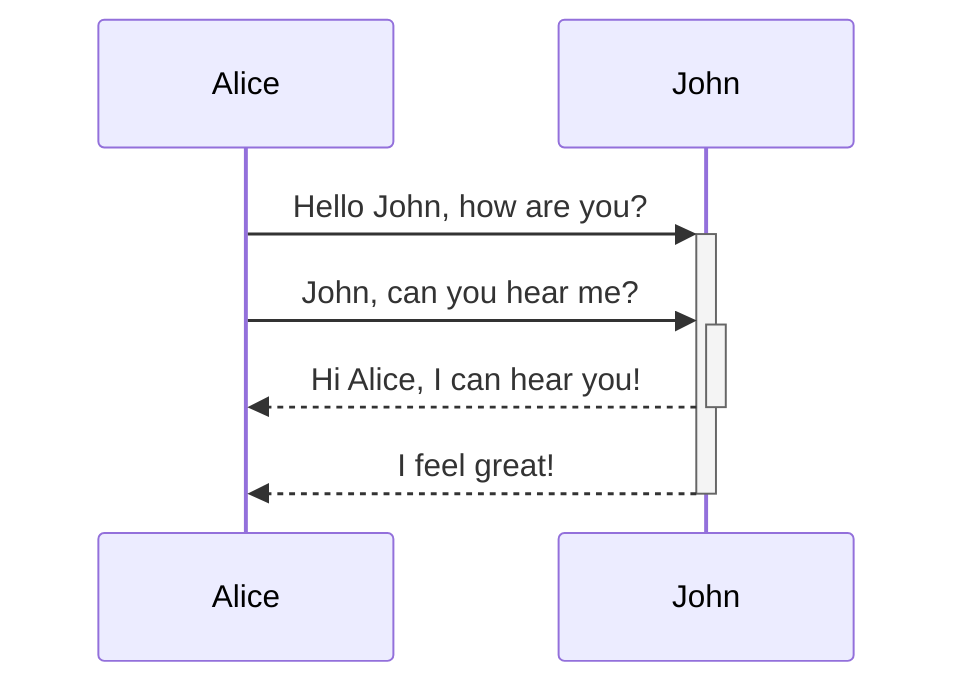

# Basic formatting syntax
Learn how to apply basic formatting to your notes, using [Markdown](https://daringfireball.net/projects/markdown/). For more advanced formatting syntax, refer to [Advanced formatting syntax](https://help.obsidian.md/advanced-syntax).
### Paragraphs

- Add **two spaces** at the end of a line before pressing `Enter`, or
- Use the shortcut `Shift + Enter` to directly insert a line break.

### Headings

To create a heading, add up to six `#` symbols before your heading text. The number of `#` symbols determines the size of the heading.
```markdown
# This is a heading 1
## This is a heading 2
### This is a heading 3
#### This is a heading 4
##### This is a heading 5
###### This is a heading 6
```
# This is a heading 1
## This is a heading 2
### This is a heading 3
#### This is a heading 4
##### This is a heading 5
###### This is a heading 6


### Bold,italics,highlights
| Style                  | Syntax                 |     | Output                                 |
| ---------------------- | ---------------------- | --- | -------------------------------------- |
| Bold                   | `** **` or `__ __`     |     | **Bold text**                          |
| Italic                 | `* *` or `_ _`         |     | _Italic text_                          |
| Strikethrough          | `~~ ~~`                |     | ~~Striked out text~~                   |
| Highlight              | == ==                  |     | ==Highlighted text==                   |
| Bold and nested italic | `** **` and `_ _`      |     | **Bold text and _nested italic_ text** |
| Bold and italic        | `*** ***` or `___ ___` |     | **_Bold and italic text_**             |
Formatting can be forced to display in plain text by adding a backslash `\` in front of it.
```markdown
\*\*This line will not be bold\*\*
```
\*\*This line will not be bold\*\*
### Internal links
Obsidian supports two formats for  [internal links](https://help.obsidian.md/links) between notes:
- Wikilink: `[[Three laws of motion]]`
- Markdown: `[Three laws of motion](Three%20laws%20of%20motion.md)`
### External links
If you want to link to an external URL, you can create an inline link by surrounding the link text in brackets (`[ ]`), and then the URL in parentheses (`( )`).
```markdown
[Obsidian Help](https://help.obsidian.md)
```
[Obsidian Help](https://help.obsidian.md)
You can also create external links to files in other vaults, by linking to an [Obsidian URI](https://help.obsidian.md/Extending+Obsidian/Obsidian+URI).
### Escape blank spaces in links 

If your URL contains blank spaces, you must escape them by replacing them with `%20`.
You can also escape the URL by wrapping it with angled brackets (`< >`).
```markdown
[My Note](obsidian://open?vault=MainVault&file=My%20Note.md)

[My Note](<obsidian://open?vault=MainVault&file=My Note.md>)
```
### External images 

You can add images with external URLs, by adding a `!` symbol before an **External links**.
```markdown

```


You can change the image dimensions, by adding `|640x480` to the link destination, where 640 is the width and 480 is the height.
```markdown


```
If you only specify the width, the image scales according to its original aspect ratio. For example:
```markdown

```

### Quotes
You can quote text by adding a `>` symbols before the text.
```markdown
> Human beings face ever more complex and urgent problems, and their effectiveness in dealing with these problems is a matter that is critical to the stability and continued progress of society.

\- Doug Engelbart, 1961
```
> Human beings face ever more complex and urgent problems, and their effectiveness in dealing with these problems is a matter that is critical to the stability and continued progress of society.

\- Doug Engelbart, 1961

### Lists
You can create an unordered list by adding a `-`, `*`, or `+` before the text.
```markdown
- First list item
- Second list item
- Third list item
```
- First list item
- Second list item
- Third list item
To create an ordered list, start each line with a number followed by a `.` or `)` symbol.
```markdown
1. First list item
2. Second list item
3. Third list item
```
1. First list item
2. Second list item
3. Third list item

### Task lists 

To create a task list, start each list item with a hyphen and space followed by `[ ]`.

```markdown
- [x] This is a completed task.
- [ ] This is an incomplete task.
- [?] Eggs.
```
- [x] This is a completed task.
- [ ] This is an incomplete task.
- [?] Eggs.
To create a nested list, indent one or more list items. You can mix list types within a nested structure:
```markdown
1. First list item
   2. Ordered nested list item
3. Second list item
   - Unordered nested list item
```
1. First list item
   2. Ordered nested list item
3. Second list item
   - Unordered nested list item
Similarly, you can create a nested task list by indenting one or more list items:
```markdown
- [ ] Task item 1
	- [ ] Subtask 1
- [ ] Task item 2
	- [ ] Subtask 1
```
- [ ] Task item 1
	- [ ] Subtask 1
- [ ] Task item 2
	- [ ] Subtask 1

Use `Tab` or `Shift+Tab` to indent or unindent selected list items to easily organize them.
### Horizontal rule 
You can use three or more stars `***`, hyphens `---`, or underscore `___` on its own line to add a horizontal bar. You can also separate symbols using spaces.
```markdown
***
****
* * *
---
----
- - -
___
____
_ _ _
```

***
## Code
### Inline code 
You can format code within a sentence using single backticks.

```markdown
Text inside `backticks` on a line will be formatted like code.
```
Text inside `backticks` on a line will be formatted like code.
### Code blocks 
To format code as a block, enclose it with three backticks or three tildes.
````
```
cd ~/Desktop
```
````

```
~~~
cd ~/Desktop
~~~
```

```md
cd ~/Desktop
```

You can also create a code block by indenting the text using `Tab` or 4 blank spaces.
```md
    cd ~/Desktop
```

You can add syntax highlighting to a code block, by adding a language code after the first set of backticks.
````md
```js
function fancyAlert(arg) {
  if(arg) {
    $.facebox({div:'#foo'})
  }
}
```
````

```js
function fancyAlert(arg) {
  if(arg) {
    $.facebox({div:'#foo'})
  }
}
```

## Footnotes 

You can add footnotes to your notes using the following syntax:
```md
This is a simple footnote[^1].

[^1]: This is the referenced text.
[^2]: Add 2 spaces at the start of each new line.
  This lets you write footnotes that span multiple lines.
[^note]: Named footnotes still appear as numbers, but can make it easier to identify and link references.
```

This is a simple footnote[^1].

[^1]: This is the referenced text.
[^2]: Add 2 spaces at the start of each new line.
  This lets you write footnotes that span multiple lines.
[^note]: Named footnotes still appear as numbers, but can make it easier to identify and link references.

You can also inline footnotes in a sentence. Note that the caret goes outside the brackets.

```md
You can also use inline footnotes. ^[This is an inline footnote.]
```
You can also use inline footnotes. ^[This is an inline footnote.]

## Comments 
You can add comments by wrapping text with `%%`. Comments are only visible in Editing view.
```md
This is an %%inline%% comment.

%%
This is a block comment.

Block comments can span multiple lines.
%%
```
This is an %%inline%% comment.

%%
This is a block comment.

Block comments can span multiple lines.
%%

## Escaping Markdown Syntax 

In some cases, you may need to display special characters in Markdown, such as `*`, `_`, or `#`, without triggering their formatting. To display these characters literally, place a backslash (`\`) before them.

Common characters to escape
- Asterisk: `\*`
- Underscore: `\_`
- Hashtag: `\#`
- Backtick: `` \` ``
- Pipe (used in tables): `\|`
- Tilde: `\~`
# Advanced  formatting syntax
## Tables
You can create tables using vertical bars (`|`) to separate columns and hyphens (`-`) to define headers. Here's an example:
```markdown
| First name | Last name |
| ---------- | --------- |
| Max        | Planck    |
| Marie      | Curie     |
```

| First name | Last name |
| ---------- | --------- |
| Max        | Planck    |
| Marie      | Curie     |

You can insert a table using the **Insert Table** command from the [Command Palette](https://help.obsidian.md/plugins/command-palette) or by right-clicking and selecting _Insert → Table_. This will give you a basic, editable table.

Note that cells don't need perfect alignment, but the header row must contain at least two hyphens:
```markdown
First name | Last name
-- | --
Max | Planck
Marie | Curie
```
Align text in columns by adding colons (`:`) to the header row. You can also align content in _Live Preview_ via the context menu.
```markdown
Left-aligned text | Center-aligned text | Right-aligned text
:-- | :--: | --:
Content | Content | Content
```

Left-aligned text | Center-aligned text | Right-aligned text
:-- | :--: | --:
Content | Content | Content
## Diagram
You can add diagrams and charts to your notes, using [Mermaid](https://mermaid-js.github.io/). Mermaid supports a range of diagrams, such as [flow charts](https://mermaid.js.org/syntax/flowchart.html), [sequence diagrams](https://mermaid.js.org/syntax/sequenceDiagram.html), and [timelines](https://mermaid.js.org/syntax/timeline.html).

To add a Mermaid diagram, create a `mermaid` [code block](https://help.obsidian.md/syntax#Code%20blocks).



## Math
You can add math expressions to your notes using [MathJax](http://docs.mathjax.org/en/latest/basic/mathjax.html) and the LaTeX notation.
To add a MathJax expression to your note, surround it with double dollar signs (`$$`).
```markdown
$$
\begin{vmatrix}a & b\\
c & d
\end{vmatrix}=ad-bc
$$
```
$$
\begin{vmatrix}a & b\\
c & d
\end{vmatrix}=ad-bc
$$
You can also inline math expressions by wrapping it in `$` symbols.
```markdown
This is an inline math expression $e^{2i\pi} = 1$.
```
This is an inline math expression $e^{2i\pi} = 1$.

For more information about the syntax, refer to [MathJax basic tutorial and quick reference](https://math.meta.stackexchange.com/questions/5020/mathjax-basic-tutorial-and-quick-reference).
For a list of supported MathJax packages, refer to [The TeX/LaTeX Extension List](http://docs.mathjax.org/en/latest/input/tex/extensions/index.html).

# Obsidian Flavored Markdown
Obsidian strives for maximum capability without breaking any existing formats. As a result, we use a combination of flavors of [Markdown](https://help.obsidian.md/syntax).

Obsidian supports [CommonMark](https://commonmark.org/), [GitHub Flavored Markdown](https://github.github.com/gfm/), and [LaTeX](https://www.latex-project.org/). Obsidian does not support using Markdown formatting or blank lines inside of HTML tags.
### Supported Markdown extensions 

| Syntax          | Description                                                                              |
| --------------- | ---------------------------------------------------------------------------------------- |
| `[[Link]]`      | [Internal links](https://help.obsidian.md/links)                                         |
| `![[Link]]`     | [Embed files](https://help.obsidian.md/embeds)                                           |
| `![[Link#^id]]` | [Block references](https://help.obsidian.md/links#Link%20to%20a%20block%20in%20a%20note) |
| `^id`           | [Defining a block](https://help.obsidian.md/links#Link%20to%20a%20block%20in%20a%20note) |
| `[^id]`         | [Footnotes](https://help.obsidian.md/syntax#Footnotes)                                   |
| `%%Text%%`      | [Comments](https://help.obsidian.md/syntax#Comments)                                     |
| `~~Text~~`      | [Strikethroughs](https://help.obsidian.md/syntax#Bold,%20italics,%20highlights)          |
| == Text ==      | [Highlights](https://help.obsidian.md/syntax#Bold,%20italics,%20highlights)              |
| ` ``` `         | [Code blocks](https://help.obsidian.md/syntax#Code%20blocks)                             |
| `- [ ]`         | [Incomplete task](https://help.obsidian.md/syntax#Task%20lists)                          |
| `- [x]`         | [Completed task](https://help.obsidian.md/syntax#Task%20lists)                           |
| `> [!note]`     | [Callouts](https://help.obsidian.md/callouts)                                            |
| (see link)      | [Tables](https://help.obsidian.md/advanced-syntax#Tables)                                |
# Tags
Tags are keywords or topics that help you quickly find the notes you want.
## Add a tag to a note
To create a tag, enter a hash symbol (`#`) in the editor, followed by a keyword. For example, `#meeting`.

You can also add tags using the `tags` [property](https://help.obsidian.md/properties). Tags in YAML should always be formatted as a list:
```markdown
---
tags:
  - recipe
  - cooking
---
```

## Find notes using tags 

To find notes using the [Search](https://help.obsidian.md/plugins/search) plugin, use the `tag` [search operator](https://help.obsidian.md/plugins/search#Search%20operators) in your search term, for example `tag:#meeting`.

You can also search for tags by clicking on them in your notes.

To find notes using the [Tags view](https://help.obsidian.md/plugins/tags) plugin, select **Tags: Show tags** in the [Command palette](https://help.obsidian.md/plugins/command-palette), and then select the tag you want to search for.

## Nested tags 

Nested tags define tag hierarchies that make it easier to find and filter related tags.

Create nested tags by using forward slashes (`/`) in the tag name, for example `#inbox/to-read` and `#inbox/processing`.

Both the [Search](https://help.obsidian.md/plugins/search) and [Tags view](https://help.obsidian.md/plugins/tags) plugins support nested tags.
## Tag format 

You can use any of the following characters in your tags:

- Alphabetical letters
- Numbers
- Underscore (`_`)
- Hyphen (`-`)
- Forward slash (`/`) for [Nested tags](https://help.obsidian.md/tags#Nested%20tags)

Tags must contain at least one non-numerical character. For example, #1984 isn't a valid tag, but [#y1984](https://publish.obsidian.md/#y1984) is.

Tags are case-insensitive. For example, [#tag](https://publish.obsidian.md/#tag) and [#TAG](https://publish.obsidian.md/#TAG) will be treated as identical.

>[!note]
>Tags will display with the casing they are first created with in the [Tags view](https://help.obsidian.md/plugins/tags).  
For example, creating [#Tag](https://publish.obsidian.md/#Tag) and then [#TAG](https://publish.obsidian.md/#TAG) will display [#Tag](https://publish.obsidian.md/#Tag) for both.

Tags can't contain blank spaces. To separate two or more words, you can instead use the following formats:
- [#camelCase]
- [#PascalCase]
- [#snake_case]
- [#kebab-case]

# Callouts

Use callouts to include additional content without breaking the flow of your notes.

To create a callout, add `[!info]` to the first line of a blockquote, where `info` is the _type identifier_. The type identifier determines how the callout looks and feels. To see all available types, refer to [Supported types](https://help.obsidian.md/callouts#Supported%20types). Callouts are also supported natively on [Obsidian Publish](https://help.obsidian.md/publish).
```markdown
> [!info] Here's a callout title
> Here's a callout block.
> It supports **Markdown**, [[Internal link|Wikilinks]], and [[Embed files|embeds]]!
```
> [!info] Here's a callout title
> Here's a callout block.
> It supports **Markdown**, [[Internal link|Wikilinks]], and [[Embed files|embeds]]!
## Change the title

By default, the title of the callout is its type identifier in title case. You can change it by adding text after the type identifier:
```markdown
> [!tip] Callouts can have custom titles
> Like this one.
```
> [!tip] Callouts can have custom titles
> Like this one.

You can even omit the body to create title-only callouts:
> [!tip] Title-only callout

## Foldable callouts 

You can make a callout foldable by adding a plus (`+`) or a minus (`-`) directly after the type identifier.

A plus sign expands the callout by default, and a minus sign collapses it instead.
```markdown
> [!faq]- Are callouts foldable?
> Yes! In a foldable callout, the contents are hidden when the callout is collapsed.
```
> [!faq]- Are callouts foldable?
> Yes! In a foldable callout, the contents are hidden when the callout is collapsed.

## Nested callouts 

You can nest callouts in multiple levels.
```markdown
> [!question] Can callouts be nested?
> > [!todo] Yes!, they can.
> > > [!example]  You can even use multiple layers of nesting.
```
> [!question] Can callouts be nested?
> > [!todo] Yes!, they can.
> > > [!example]  You can even use multiple layers of nesting.

## Customize callouts 

[CSS snippets](https://help.obsidian.md/snippets) and [Community plugins](https://help.obsidian.md/community-plugins) can define custom callouts, or even overwrite the default configuration.

To define a custom callout, create the following CSS block:
```css
.callout[data-callout="custom-question-type"] {
    --callout-color: 0, 0, 0;
    --callout-icon: lucide-alert-circle;
}
```
The value of the `data-callout` attribute is the type identifier you want to use, for example `[!custom-question-type]`.
- `--callout-color` defines the background color using numbers (0–255) for red, green, and blue.
- `--callout-icon` can be an icon ID from [lucide.dev](https://lucide.dev/), or an SVG element.
>[!custom-question-type] custom-question-type

Instead of using a Lucide icon, you can also use a SVG element as the callout icon.

```css
--callout-icon: '<svg>...custom svg...</svg>';
```
## Supported types
You can use several callout types and aliases. Each type comes with a different background color and icon.

To use these default styles, replace `info` in the examples with any of these types, such as `[!tip]` or `[!warning]`. Callout types can also be changed by right-clicking a callout in Live Preview mode.

Unless you [Customize callouts](https://help.obsidian.md/callouts#Customize%20callouts), any unsupported type defaults to the `note` type. The type identifier is case-insensitive.

>[!Note]
>```md
> [!note]
> Lorem ipsum dolor sit amet
>```

---

>[!Abstract]
>```md
> [!abstract]
> Lorem ipsum dolor sit amet
>```

Aliases: `summary`, `tldr`

---

>[!Info]
>```md
> [!info]
> Lorem ipsum dolor sit amet
>```

---

>[!Todo]
>```md
> [!todo]
> Lorem ipsum dolor sit amet
>```

---

>[!Tip]
>```md
> [!tip]
> Lorem ipsum dolor sit amet
>```

Aliases: `hint`, `important`

---

>[!Success]
>```md
> [!success]
> Lorem ipsum dolor sit amet
>```

Aliases: `check`, `done`

---

>[!Question]
>```md
> [!question]
> Lorem ipsum dolor sit amet
>```

Aliases: `help`, `faq`

---

>[!Warning]
>```md
> [!warning]
> Lorem ipsum dolor sit amet
>```

Aliases: `caution`, `attention`

---

>[!Failure]
>```md
> [!failure]
> Lorem ipsum dolor sit amet
>```

Aliases: `fail`, `missing`

---

>[!Danger]
>```md
> [!danger]
> Lorem ipsum dolor sit amet
>```


Alias: `error`

---

>[!Bug]
>```md
> [!bug]
> Lorem ipsum dolor sit amet
>```
---

>[!Example]
>```md
> [!example]
> Lorem ipsum dolor sit amet
>```
---

>[!Quote]
>```md
> [!quote]
> Lorem ipsum dolor sit amet
>```


Alias: `cite`

# Properties
Properties allow you to organize information about a note. Properties contain structured data such as text, links, dates, checkboxes, and numbers. Properties can also be used in combination with [Community plugins](https://help.obsidian.md/community-plugins) that can do useful things with your structured data.

## Add properties to a note
There are several ways to add a property to a note:

- Use the **Add file property** [command](https://help.obsidian.md/plugins/command-palette).
- Use the **`Cmd/Ctrl+;`** [hotkey](https://help.obsidian.md/hotkeys).
- Choose **Add file property** from the **More actions** menu (brought up by the three dots icon or by right-clicking the tab).
- Type `---` at the very beginning of a file.

Once you add a property, a row will appear at the top of the file with two inputs: the property _name_ and the property _value_.

For the name, you can choose anything you like. Obsidian provides several default properties: `tags`, `cssclasses`, and `aliases`.

Once you choose the property name, you can give it a value.
## Property types
In addition to a name and value, properties also have a _type_. A property's type determines what kind of values it can store and how Obsidian handles them. To change the type of a property, click the type icon next to the property name and select a different option. You can also manage property types using the [Properties view](https://help.obsidian.md/plugins/properties) core plugin.

Obsidian supports the following property types:
- **[Text](https://help.obsidian.md/properties#^text-list)**
- **[List](https://help.obsidian.md/properties#^text-list)**
- **[Number](https://help.obsidian.md/properties#^numbers)**
- **[Checkbox](https://help.obsidian.md/properties#^checkbox)**
- **[Date](https://help.obsidian.md/properties#^date-time)**
- **[Date & time](https://help.obsidian.md/properties#^date-time)**

Once a property type is assigned to a property name, all properties with that name across your vault will use the same type.

## Property format 

Properties are stored in [YAML](https://yaml.org/) format at the top of the file. YAML is a popular format that is easy for both humans and computers to read.

Property names are separated from their values by a colon followed by a space:

```yaml
---
name: value
---
```

While the order of each name-value pair doesn't matter, each name must be unique within a note. For example, you can't have more than one `tags` property.

Values can be text, numbers, true or false, or even collections of values (lists).  

```yaml
---
title: A New Hope # This is a text property
year: 1977
favorite: true
cast: # This is a list property
  - Mark Hamill
  - Harrison Ford
  - Carrie Fisher
---
```

### Links 

[Internal links](https://help.obsidian.md/links) in **Text** and **List** type properties must be surrounded with quotes. Obsidian will automatically add these if you manually enter internal links into properties, but be careful to add them when using templating plugins.

```yaml
---
link: "[[Link]]" 
linklist: 
  - "[[Link]]" 
  - "[[Link2]]"
---
```

### Numbers 

Number type properties must always be a literal number, not an expression with operators. Integers and decimals are both allowed.  

```yaml
---
year: 1977
pie: 3.14
---
```

### Checkboxes 

Checkbox type properties are either `true` or `false`. An empty property will be treated as `false`. In Live Preview, this will be represented as a checkbox.  

```yaml
---
favorite: true
reply: false
last: # this will default to false
```

### Dates 

**Date** and **Date & time** type properties are stored in the following format:  

```yaml
---
date: 2020-08-21
time: 2020-08-21T10:30:00
---
```
### JSON properties 

While we recommend using YAML to define properties, you can also define properties using [JSON](https://www.json.org/):

```json
---
{
  "tags": ["journal"],
  "publish": false
}
---
```

Note that the JSON block will be read, interpreted, and saved as YAML.

## Default properties 

Obsidian comes with a set of default properties:

|Property|Type|Description|
|---|---|---|
|`tags`|List|See [Tags](https://help.obsidian.md/tags).|
|`aliases`|List|See [Aliases](https://help.obsidian.md/aliases).|
|`cssclasses`|List|Allows you to style individual notes using [CSS snippets](https://help.obsidian.md/snippets).|

### Properties for Obsidian Publish 

The following default properties can be used with [Obsidian Publish](https://help.obsidian.md/publish):

|Property|Description|
|---|---|
|`publish`|See [Automatically select notes to publish](https://help.obsidian.md/publish/publish#Automatically%20select%20notes%20to%20publish).|
|`permalink`|See [Permalinks](https://help.obsidian.md/publish/permalinks).|
|`description`|See [Description](https://help.obsidian.md/publish/social-share#Description).|
|`image`|See [Image](https://help.obsidian.md/publish/social-share#Image).|
|`cover`|See [Image](https://help.obsidian.md/publish/social-share#Image).|

### Deprecated properties 

These properties were deprecated in Obsidian 1.4 and should be replaced with their modern equivalents. Support for them as [Default properties](https://help.obsidian.md/properties#Default%20properties) is dropped in Obsidian 1.9.

|Property|Description|
|---|---|
|`tag`|Deprecated alias for `tags`.|
|`alias`|Deprecated alias for `aliases`.|
|`cssclass`|Deprecated alias for `cssclasses`.|

If you need to convert your files in your vault to the [Default properties](https://help.obsidian.md/properties#Default%20properties) format, you can use [Format converter](https://help.obsidian.md/plugins/format-converter) to change your vault en masse.


# Embed web pages
Learn how to use the [iframe](https://developer.mozilla.org/en-US/docs/Web/HTML/Element/iframe) HTML element to embed web pages in your notes.

To embed a web page, add the following in your note and replace the placeholder text with the URL of the web page you want to embed:

```html
<iframe src="INSERT YOUR URL HERE"></iframe>
```

>[!Note]
>Some websites don't allow you to embed them. Instead, they may provide URLs that are meant for embedding them. If the website doesn't support embedding, try searching for the name of the website followed by "embed iframe". For example, "youtube embed iframe".

>[!Tip]
If you're using [Canvas](https://help.obsidian.md/plugins/canvas), you can embed a web page in a card. For more information, refer to [Canvas > Add cards from web pages](https://help.obsidian.md/plugins/canvas#Add%20cards%20from%20web%20pages).

## Embed a YouTube video 

To embed a YouTube video, use the same Markdown syntax as [external images](https://help.obsidian.md/syntax#External%20images):

```md

```

## Embed a tweet 

To embed a tweet, use the same Markdown syntax as [external images](https://help.obsidian.md/syntax#External%20images):

```md

```

# HTML content
Obsidian supports HTML to allow you to display your notes the way you want, or even [embed web pages](https://help.obsidian.md/embed-web-pages). Allowing HTML inside your notes comes with risks. To prevent malicious code from doing harm, Obsidian _sanitizes_ any HTML in your notes.

>[!Example]
The `<script>` element normally lets you run JavaScript whenever it loads. If Obsidian didn't sanitize HTML, an attacker could convince you to paste a text containing JavaScript that extracts sensitive information from your computer and sends it back to them.

That said, since Markdown syntax does not support all forms of styling, using sanitized HTML can be yet another way of enhancing the quality of your notes. We've included some of the more common usages of HTML.

>[!note] More details on using `<iframe>` can be found in [Embed web pages](https://help.obsidian.md/embed-web-pages).

### Comments 

[Markdown comments](https://help.obsidian.md/syntax#Comments) are the preferred way of adding hidden comments within your notes. However some methods of converting Markdown notes, such as [Pandoc](https://pandoc.org/), have limited support of Markdown comments. In those instances, you can use a `<!-- HTML Comment -->` instead!

### Underline 

If you need to quickly underline an item in your notes, you can use `<u>Example</u>` to create your underlined text.

### Span/Div 

Span and div tags can be used to apply custom classes from a [CSS snippet](https://help.obsidian.md/snippets), or custom defined styling, onto a selected area of text. For example, using `<span style="font-family: cursive">your text</span>` can allow you to quickly change your font.

### Strikethrough 

Need to strike ~~some text~~? Use `<s>this</s>` to strike it out.